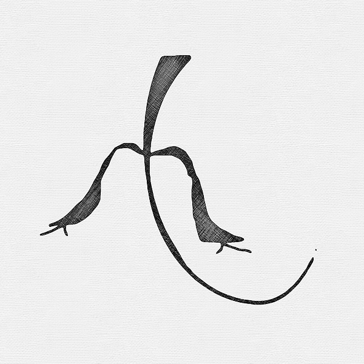

<head>
<link rel="apple-touch-icon" sizes="180x180" href="/apple-touch-icon.png">
<link rel="icon" type="image/png" sizes="32x32" href="/favicon-32x32.png">
<link rel="icon" type="image/png" sizes="16x16" href="/favicon-16x16.png">
<link rel="manifest" href="/site.webmanifest">
<meta name="viewport" content="width=device-width, initial-scale=1">

</head>

**ShortLink: <a href="https://qti.ai/b7" target="_blank">qti.ai/b7</a>**

**<a href="https://b7.github.io" >HOME</a> <a href="https://b7.github.io/#about" >ABOUT</a> <a href="https://b7.github.io/#contact" >CONTACT</a> <a href="https://b7.github.io/legal" >LEGAL</a>**

<strong>Peecee</strong>

**Listen Peecee**
<audio src="/peecee.mp3" controls=""></audio>

### Peecee
this story is dedicated to all children of this earth and to all adults who have not lost the child in themselves. the beginning of the story is the "importance of peaceful action". i have experienced violence myself and learned from it that it never leads to a sensible solution. especially children who are affected by violence suffer lifelong damage. mostly some of the violence is passed on to the next generation. I wrote peecee in the hope that they would read my story to their children, that they would be peacefully influenced by it, that they would treat their own children more peacefully, so that perhaps in seven generations it would reach everyone.
peecee
### peecee
the question is: who is peecee, where does he come from and above all does he really exist? peecee is not a hero or a fictional character and he really does exist. peecee is a wonderful being from another world. the world he comes from is very similar to earth, with some differences. peecee‘s home is green. there are all things in green colors. thousands of different green colors. the sun also shines green and the moon and the stars are green too. there is even more different from ours. time is eternal. That means the beings are born like us and also grow up, but they do not die. they live forever in love, just like the name of their world. the space is also unlimited. when a woman and man are ready to live together, a common space is thought of and it is there. peecee is a very special one of his kind. he wants to marry princess deedee, but the queen and the king want their daughter to be in safe hands and send peecee on a test to earth where he is supposed to solve a problem. peecee himself is also a prince and he could be with another woman. but he likes deedee. he says: "she is cute and intelligent at the same time". and they have already met. deedee likes peecee too. she just thinks he's cute and charming. she says: "he's cute and humorous." but why does peecee have to go down to earth? well, earth is one of those worlds where there are problems that are not easy to solve. and peecee‘s grandfather was already on earth. unfortunately he never came back. it is believed that he fell in love with the earth and wanted to stay there. he had to make a difficult decision because the beings on earth are mortal. and back then you didn't have to go to earth or a similar world because of a woman. but whenever there was a problem somewhere in the world. peecee‘s grandfather already had four children at the time. but they were already grown up and agreed to it. his wife also agreed. the beings in the world of love can speak to one another in thoughts over very great distances. until a great flood broke out on earth they still talked to each other and in their thoughts he is still with them.
### mimbai
mimbai is a small human child, a girl aged seven. she is in the second grade and is a very good student. she likes to paint and play the piano and also sings beautifully. mimbai has a big brother, the bimbai. bimbai is nine years old and is in the fourth grade. he is also very good at school and prefers to do sports. he also plays the guitar, raps and writes his own lyrics. mimbai's mother is called mumbai and she is a doctor in a hospital for physically handicapped children. her father's name is bumbai and is an architect and draws houses. mimbai plays the second leading role in this story. she is said to always be honest and fair to everyone. but in one thing it is very peculiar. she has green hair. she wished that for her fifth birthday and since then she has always had green hair. it suits her well. mimbai's family lives a little outside the city. the parents like the country air and it's healthier too. the next city is hamiwu and is located in the country palita. it is a time when there are no more wars between countries. the year is 2257 and it is summer. palita is located on the continent america. this year mimbai‘s family wants to go to australia, sonida, the city of humania. it is a historical city with a lot of sights. but there are still three months until the summer holidays and mimbai is already very impatient. because she always wanted to see real indians. and near humania there should be some more. In addition, the indians ensured peace on earth 200 years ago. this is why mimbai is particularly fond of indians. Back then, all cities and countries were given different names than they had before. only the continents remained the same. and cars have also been abolished. since then there have been small spaceships for the city and large spaceships for traveling far.
### the first encounter
it was a friday. mimbai came out of school. mumbai had just started cooking. Mimbai went into her room and wanted to practice a little on the piano when suddenly something very strange happened. Mimbai had an electric piano and it suddenly fell silent. she tried everything, but the piano just didn't work anymore. then she wanted to turn on her music system, but that didn't work either. and the alarm clock didn't work either. Mimbai sat down on her bed and was about to start reading a book. and out of nowhere stood peecee in front of her. or better said, it hovered in front of her. "O," said mimbai. and peecee said: “don't be scared, little girl.” mimbai asked: “who are you, where are you from and what are you doing here?” peecee introduced himself and asked mimbai for her name. mimbai asked why peecee came to her. and he replied: “I don't know. i am supposed to solve some problem and you have to deal with it. ”but mimbai said:“ i have no problem. ”“ then maybe it's just the place. I have to look around. ”Peecee replied and disappeared again as he came. mimbai shouted: “stop wait.” but then the music came from the system, which she had already switched on.
### mimbai tells about peecee
after dinner, mimbai called her brother into her room and told him what had happened. but bimbai didn't believe it. he said to her that maybe she dreamed it. mimbai described peecee very precisely and bimbai simply said that she imagined it. mimbai was disappointed. she thought her brother could help her. on monday at school mimbai met her best friend and also told her what had happened, but she just laughed at mimbai and started to tell the other girls what mimbai had told her. until then everyone made fun of mimbai. she was now very sad and didn't know what to do next. in the end she went to her parents and talked to them about peecee. but they too had no understanding of it. they just said: “sometimes you see things that are not there. that's like in a dream. that can happen. ”Mimbai said it wasn't a dream and swore it all really happened. now mimbai was completely alone with her experience and nobody could understand her. she kept thinking about peecee and also at school. This made her inattentive in class. that much on the teachers. One of the teachers then spoke to her and asked Mimbai what was going on and she told her about peecee again. the teacher said to her: “you have to go to the school psychologist, she will examine you.” mimbai went to her on wednesday and also told her about peecee that no one can understand her and asked her for help. the school psychologist said: “tell me more about peecee.” and mimbai reported exactly, every detail of what he looked like and so on. then she had to paint a picture of peecee. At the end of the conversation the psychologist said: “You can go. I'll get in touch with you. ”Mimbai didn't feel taken seriously by her either. when mimbai got home after school, bumbai wanted to talk to her. he told her that she had to leave school and was going to another school. and she had to promise her father not to tell anyone about peecee again. the school psychologist had made sure that mimbai was no longer allowed to go to her school.
### panimulator
panimulator is the owner of the largest toy company on earth. actually he only makes bad toys. his only concern is that as many as possible are sold. and the toys aren't pretty either. mostly there are characters from films that he made himself. or machines and weapons. smart children do not play with his toys. the toys also break quickly because the characters fight each other. He did it so that you have to buy new ones again. panimulator itself has no ideas for toys. he has secret employees everywhere who steal the ideas of clever people and bring them to him. that's because panimulator never went to school. he only flew through the area with his skyboard and annoyed the people. Unfortunately, as an only child, he got all of his parents' money when they died. and they owned a big city. he sold the city and used the money to buy a toy company, the largest film studios in the world and many television stations. the school psychologist from the mimbai school was also one of his employees. she brought him the information from mimbai about peecee and also showed him the painted picture. panimulator liked that, except for one small thing. peecee should have a gun. and his scientists were in the process of building a laser as a toy that would take away the children's dreams when they play with it. that was top secret because otherwise it would be banned. if the children no longer dream, they could watch television at night. and at night the panimulator films were shown. the more he saw his films the more he got money for them. but this time he had bigger plans. he wanted to get the adults on his side too and was planning a pilgrimage town. peecee was a perfect fit for his plan. he always planned everything very precisely and prepared it in the three months leading up to the summer vacation. mimbai‘s family shouldn't notice. and when you went on vacation everything should begin. first a film was made, then the toys for it. and by the way a huge amusement park as pilgrimage cities, with an oversized peecee, which floated in the air in the middle of the park and carried a laser.
### the summer holidays begin
finally the summer holidays were here and mimbai was happy. at the new school she felt good, but it was hard to get used to. now we went to australia, to the continent of miracles. that's what it was called. mimbai was the first to finish packing and helped bimbai. Mumbai soon came and asked if they were all ready. "It's about to start," she said. first bumbai flew them with the small spaceship to the airport and from there it went on with a huge spaceship directly to humania, the first city of peace. the spaceship had space for 2000 people. There were rooms for children, a cinema, a restaurant and at the top and bottom there were rooms with glass walls, ceilings and floors. you could sit down and look at the sky or the earth. mimbai and bimbai decided to look at the earth from above. mumbai and bumbai looked at the sky. the whole flight took three hours. They agreed to meet after an hour in the restaurant to eat. there they all decided to swap. mimbai and bimbai now looked at each other at the sky and the parents looked at the earth from above. the three hours passed very quickly and they had arrived. from the airport we took a small spaceship to the hotel tikimuwa a little outside of humania. a nice hotel. it wasn't as big as the others and you looked directly at a huge lake. first of all they rested from the journey. the next day they went on a hike in nature and saw kangaroos for the first time. Mimbai and Bimbai thought that was funny, because they carried their babies on their belly and jumped quite far with them. Mimbai was amazed that the babies didn't get dizzy. she also kept asking about the indians she wanted to see. but mumbai and bumbai didn't know where to meet them either. At the hotel, Mumbai asked more precisely and whether one could see the indians. But they told her that it is forbidden to go to the Indian arrears. these are nature reserves and the indians had decided to live there alone with nature. "Every now and then the chief of the indians comes into the city to talk to the people about new agreements. and then he goes back. "said the woman from the information counter. "I'm sorry, but there is an indigenous museum where everything is recreated how they live," she added and gave her four tickets.
### the second encounter
It was very late in the evening and everyone went to sleep, exhausted, except for Mimbai. she had to think about peecee and she missed him. mimbai got thirsty and went to the kitchen to drink fruit juice. Everything in the hotel was voice-controlled. to switch the light on, you simply said: "light on" and the light went on. only this time the light didn't come on, but peecee was there again. Mimbai was totally happy and said: "You mustn't go straight away again." She told him what happened so that Peecee didn't even have a say. peecee was sorry for what she had to go through. he encouraged her that everything will be cleared up when the time comes. peecee told mimbai that he had come closer to the problem and that he also had a plan how to solve it. he spoke of panimulator and his project to copy peecee. After a while he said: “You have to go to sleep now. it's very late. ”he was about to disappear and mimbai asked:“ how should I tell you apart from the wrong peecee? ​​”peecee replied:“ you will recognize me by your love ”and he was gone again. the light in the kitchen went on. mimbai took the fruit juice, had a drink and then went to sleep.
### the indian museum
it was morning and today everyone wanted to go to the beach by the sea nearby. mimbai was bored and disappointed because she couldn't see any indians. at breakfast, mumbai said that it is not possible to visit the indians, but that they will go to the indian museum together. mimbai and bimbai were happy too. Mumbai said: “It starts right after breakfast. then we have the whole day. ”“ ouch yes, ”said mimbai and thanked him for the nice surprise. first they came into a huge room in the museum, in which Indian tents were called tipis. you could also go into some of the tipis. Mimbai and Bimbai thought that was great. In addition, horses have been set up with Indian jewelry. and all the museum staff was dressed in a beautiful, colorful Indian style. there were also tools and hunting weapons used by the indians. also very nice wooden boats. and everything was handmade. There were several corridors from the hall. one of the corridors showed the indians talking to one another. that was funny. first mimbai and bimbai had to laugh, but then they noticed that it sounds quite natural. it also reminded them of themselves when they were toddlers. the story of the indians was shown in another corridor. where they came from, when they existed, that they were threatened with extinction, even several times. once in 2019 when there were very few left, because the city dwellers consumed all the land and they hardly had any living space left. there were also maps on which you could see that. the other time about 7000 years ago. nobody knows the exact time. because indians don't count the years. it is written on a cloth with a brush that there was a time of drought. It hadn't rained for a long time and the ground was dry. the indians had very little to eat and drink and two tribes fought to survive.one of the tribes was on a river. the only river far and wide. and the other tribe needed water. they were about to kill each other. but when they pointed the arrows at each other, suddenly out of the blue a being flew between the tribes. it was green and made of light. they called it watantankee. he asked the tribes to stop fighting and showed them how to bring the land back to life. he showed them how to build sewers. years later there was a big flood because it was raining too much. and watantankee and some of the indians died. Most of the Indians were able to flee and saved themselves. until the water receded they lived on the mountains. when everything was back to normal, they came back and looked for the bodies of their friends to bury. some of the corpses were under rocks in the water. and one of them was just with his hand in one of the rocks. they took him out of the water with the stone. On the bank, the stone was cut in two to free the hand. an imprint of watantankee was found in the stone and his hand was on the hand of the indian. watantankee itself was made of light, so that there were no remains of him. the indians say that watantankee, in our language “the spirit of peace” has flown home. You can see the two stone parts in the display cases opposite. the indian chief donated them to the museum in honor of this city. mimbai, bimbai and their parents went to the display case opposite, saw the stones and mimbai said: “this is peecee” bumbai replied: “you promised me that you would never tell me about peecee again.” but mimbai said: “papa, peecee saw exactly that out, I'm sure. "Mumbai asked Bumbai to leave her alone and said:" Maybe she is right. I've read of something like that before. there are people who see beings from the past. ”bumbai did not contradict. when mumbai said something, bumbai held back. but this time he said: “maybe you're right. we'll check the computer in the hotel, maybe we'll find a connection there. ”Out of sheer enthusiasm, they hadn't even noticed that it was very late and the museum was about to close. they went quickly to the museum canteen, where you could eat indians and also with your hands. that was fun. then they flew back to the hotel and were completely exhausted. but because it wasn't night yet, bumbai and mimbai looked into the computer to see what else there was to know about watantankee and peecee.
### the computer
the computer also worked with voice control. bumbai said: “all information about watantankee please.” but the computer said that it cannot understand the word watantankee. then bumbai spelled the word. He said: "w-a-t-a-n-t-a-n-k-e-e." and the computer replied: "I understand" and also spelled it out and added: "Spirit of peace." indian name for a light being from another world. for more detailed information, please choose from the topics on the screen. ”you looked at the screen and there were 571 topics to choose from. they looked at each other very much, but nothing led us to what we wanted to know. then mimbai asked to look under peecee. but the computer said again that it cannot understand the word. then mimbai spelled: “p-e-e-c-e-e.” the computer replied: “got it, p-e-e-c-e-e, please wait. A whole minute passed, that was very long, because even with very difficult questions he answered after a few seconds at the latest. the computer replied: “I checked all available information. there is no knowledge about p-e-e-c-e-e. ”mimbai said:“ maybe the computer just doesn't know peecee yet. let's spell peecee differently. peecee told me that panimulator wanted to copy him. maybe he called it differently. ”They tried all sorts of letters. but each time the computer didn't know what to do with it. until bumbai got the idea to try peace-e. and they were lucky. the computer said: “peace-e, toys from the film of the same name, new release, peace-e leisure park.” mimbai shouted: “peecee told me that too. mimbai asked the computer about panimulator. the computer replied immediately: "panimulator, film and toy producer, owner of 19 television stations, the latest product peace-e as a film, toys and an amusement park, very large number of visitors and so on." now bumbai believed what mimbai had experienced and said: “Then everything you said is true.” And mimbai replied: “papa, when I was little you once told me that I should never lie and I was always honest, even if it was sometimes difficult bumbai immediately called bimbai and mumabi and showed them what they had found out. everyone apologized to mimbai and everything was fine again.
### humania
over the next few days they explored the city together. humania was beautiful. there wasn't a single street without trees. there were plants everywhere. a really colorful city. there was a lot to see. many of the residents tried to live like the indians. and no spaceships were allowed to fly into the center of the city. pure nature. everyone was on foot, on bicycles, roller skates or on horseback. the people were all very colorfully dressed. and most of them had sneakers on. even the policemen wore sneakers and feathers on their heads. the residents of the city were grateful to the indians for the peace they brought them. that's why there were a lot of things from indian culture here. They went to the zoo, which was huge and saw many extraordinary animals that did not exist in their home. one day they visited the parliament, where the mayor met and spoke with his staff. for example, whether there should be new playgrounds. on that very day the chief of the indians was present, but one was not allowed to enter the hall. mimbai thought that was a shame. she would have loved to see a real Indian. then mimbai had an idea. She took a pen and a piece of paper and wrote down everything she had experienced, adding that she would very much like to see an Indian up close. mimbai gave this note to the guards at the entrance to the hall and said: “this is for the mayor.” the guard went into the hall and gave the note to the mayor. he translated the note for the chief. the chief happily said to the mayor: “we have been expecting something like this for a long time. watantankee told our ancestors a lot about his world. let the girl come to me. ”bumbai was just adding herself to the guest book and they were about to leave. but the guard caught them in time. he said: “mimbai, you can go to see the chief. But you have to wait a little until the smoke is gone from the hall. ”When the air was clear, mimbai was finally allowed in. When she was inside, she couldn't find out who the Indian chief was because everyone was wearing Indian clothes. they weren't sitting on chairs either, but cross-legged on sand. Mimbai somehow felt that one of them had to be the Indian chief and walked straight up to him. the chief smiled at her and spoke to the mayor in indian: “she knows.” and the mayor translated it for mimbai. now mimbai was standing directly in front of the chief. he pointed to his thigh with the palm of his hand and mimbai sat on his lap. then the chief stroked Mimbai's head from back to front and the mayor said to her: “the idians do this so that you will be protected by god.” the chief said: “wikumanetwa and gave mimbai a kiss on the forehead.” the mayor translated: “he says that you will meet him again. the kiss means that he loves you as much as his own children. Mimbai understood and thanked her politely and went back to her family. she had a bright smile on her face and was happy with all her heart. Bimbai, Mumbai and Bumbai were also very happy about it, even if they couldn't even see the chief smell. they were happy with her and mumbai suggested looking at reports on indians on the computer that evening. on the way home, bumbai got all the feathers to put them on his head. when they had their feathers open, bumbai said: "now we are all indians." the following days passed very quickly. they hiked a lot, walked around the big lake and also climbed a mountain nearby. from the top you had a wonderful view of the whole country.
### hamiwu
after four weeks the vacation was over and they flew back to hamiwu. Mumbai and Bumbai had to work again. mimbai and bimbai still had three weeks until school started again. when they arrived in hamiwu, they saw huge posters from the peace-e theme park and about the new movie. the same thing on tv at home. the advertisement for peace-e could be seen everywhere. and peace-e carried a laser weapon. mimbai didn't think that was nice. they met with the children in the neighborhood. many had already bought peace-e as a toy. everyone they met loved it. yes, even the children's parents thought it was great. mimbai didn't understand. she wondered why peecee didn't mind. bimbai didn't think that was okay either and they talked to mumbai and bumbai about it. Mumbai had already suggested that they watch the movie together. they went to the cinema and watched peace-e. the film was nothing special. some evil aliens had taken the people under their control. Then the people prayed that they would be helped. Suddenly peace-e was there with his laser weapon and killed all the aliens. all the time action and shots. children shouldn't actually see that. mimbai wanted to leave after fifteen minutes, but they stayed to understand what people loved about it. bimbai, mumbai and bumbai didn't think much of the film either. they said it was boring and uninteresting. the rest of the school vacation was spent swimming. mimbai often practiced on the piano. she had won the city piano competition at her age and was preparing for the national championships. bimbai was often out in the open to play basketball. he was also allowed to appear as the youngest raper at a hip hop event. the whole family was there and it was really nice. bimbai's texts tell of love.
### the film peace-e on tv
only two months have passed and peace-e was already running as a comic series on tv. the series also ran at night. mumbai did not allow mimbai and bimbai to watch TV at night. and they didn't want to see it either. in school the children only talked about peace-e. Mimbai noticed that almost all the other children were very exhausted and tired. that worried her. they no longer played in the breaks, which is what they always did. “It had to be because they saw peace-e at night,” thought mimbai. she asked one of her classmates if she was watching peace-e. And she said: “Yes, that's better than sleeping.” Mimbai replied: “But, you have to sleep to relax and you also dream when you sleep. Such a stupid series couldn't be more beautiful. "The classmate said:" You are right mimbai, but for some time I haven't been dreaming. everything is only dark in sleep. because then I get scared, I get up and watch peace-e. "mimbai asked:" do you watch every night? "and she replied:" yes, the series is such that the next episode always ends with a story . And I don't want to miss anything. ”Mimbai wanted to know whether her parents would allow it. but the classmate said that they didn't notice because they were sleeping. mimbai thought it was bad and wanted to get an idea of ​​it for himself. in the evening when everyone was asleep mimbai stayed awake and also watched peace-e. she was totally bored with it, but she watched until the end. when the episode came to an end, there was an advertisement for the amusement park, in which there was supposedly the real, living peace-e to be seen. a deep voice from the advertising spokesman invited us to the theme park and said: “Come to peace-e. he will free you from all your problems. ”Mimbai turned off the television and went to sleep.
### the third encounter
it was the next morning. the alarm clock had just rung and mimbai woke up. When she was about to turn off the alarm clock, it went off by itself and peecee was back. Mimbai thought at first that she was dreaming, but peecee was really there. he told what he had found out about peecee and his project. he said to mimbai that the laser on the peace-e toy stole the children's dreams. and that the peace-e in the amusement park is surrounded by a large number of channels that hypnotize people and make them artificially funny and satisfied. everyone was convinced that peace-e was the right thing to do. In addition, as in the film, peace-e shoots so-called extraterrestrials flying around with its laser. peecee says it's all just a show to impress people. he thinks it's all computer controlled. he just has to find out how? mimbai was shocked when she heard this. she asked: “what can I do?” peecee replied: “nothing at all. I'll find a solution. see you soon mimbai. ”mimbai replied:“ see you soon peecee. ”and peecee was gone again. the alarm rang again and mimbai switched it off.
### the amusement park
it was a friday. shortly after mimbai and bimbai left school. Bumbai said while eating: “I have a surprise. a colleague gave me four free tickets for the peace-e theme park and we are flying there this weekend. isn't that great? ”bimbai was happy, but mimbai said:“ don't let us go there. ”and reported what peecee had told her. Mumbai and Bumbai got pensive, but decided to fly to the amusement park anyway. it was supposed to start on saturday and mimbai and bimbai had to come along. the amusement park was in the next town, ratimu. it is only ten minutes away by spaceship. it was saturday. When they landed, they saw a lot of people who wanted to go to the amusement park. and also many who came from there. they all had an artificial smile on their face. But apart from Mimbai, they didn't tell anyone. They heard a couple talking about how great it was and that they definitely had to go back. mimbai, bimbai, mumbai and bumbai were now at the entrance to the amusement park. a huge gate with lots of snakes which led to the cash registers. admission cost 100 wpps for adults and 75 wpps for children. that was pretty expensive. Mumbai was happy that they had free tickets and said: "I would not have come here for so much money." When you passed the till you came to a path where there were various things with peace-e as a picture . there were cups, plates, bed linen, underwear, towels and more. everything was very expensive and not even beautiful. further down the path, which led like a spiral to the middle of the square, there were restaurants and arcades with electronic games, various observation towers and other nonsense that was typical for amusement parks. At the end of the way there was a huge square, surrounded by a very high wall with small gates as a passage. mimbai, bimbai, mumbai and bumbai went in through one of the gates. it was very bright in the square. spotlights shone on the wall. in the middle of the square was an artificial round pond with phosphorous blue water in it. and above the pond, peace-e floated with a laser in hand. he used it to shoot monsters that came down from the sky. as soon as he met them, they plunged into the water, where they went up in a flash and then disappeared. mimbai found it desolate and said: "this is not peecee, this is just a machine." Panimulator's scientists had placed an invisible, fine cloud of dust over the pond onto which images from a computer were thrown. like in the cinema, only on fine dust instead of a canvas. and the monsters and peace-e were just pictures. the end somehow seemed to spin the computer. peace-e no longer hit the monsters with its laser. he shot wildly through the area. also in the direction of the audience. until he injured a little boy in the eye and who screamed in pain: “my eye, my eye.” the other spectators shouted: “that was definitely an alien in human form too.” mimbai said aloud: “no, that's just a boy , and that one is not peecee. the little boy was too grounded and cried. at that moment came peecee. it was clearly visible over the pond. suddenly the false peace-e disappeared and the headlights went out too. the real peecee flew to the little boy, picked him up and floated with him. he stretched out one hand towards the sky and placed the other hand on the boy's eye. The boy was happy and said: “I can see again, thank you.” The viewers now also saw what was real. everyone now saw the fine cloud of dust and the fraud was revealed. the viewers all asked for their money back and also gave back the things they had bought there. they also displayed panimulator. before the supreme court he was found guilty of many acts. the amusement park was converted into a children's park. the films were also no longer shown and panimulator had to give away everything that belonged to him. Furthermore, he had to go back to school because the judge said that all of this could only happen because the panimulator had not formed.

By Kai Adam

### CONTACT

**Kai Adam - CEO & Founder Of b7**

**<a href="mailto:	b7.github@gmail.com" target="_blank">Mail</a>**

**<a href="https://m.me/b7.github.io" target="_blank">Messenger</a>**

### FIND
**<a href="https://github.com/b7" target="_blank">GithHub</a>**

**<a href="https://twitter.com/b7git" target="_blank">twitter</a>**

**<a href="https://facebook.com/b7.github.io" target="_blank">facebook</a>**

**<a href="https://instagram.com/b7.github.io" target="_blank">Instagram</a>**

Copyright © 2019 - 2020 b7
